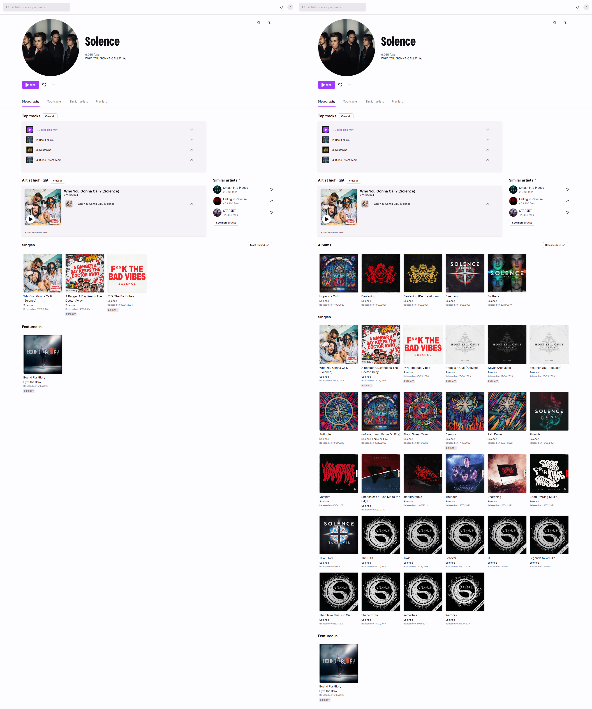

# Deezer More Albums

Some albums on Deezer are not visible on artists' discography pages. This script makes them visible and adds live, karaoke, and compilation albums to the "Albums" section.

> [!NOTE]
> Currently, the Deezer API is very slow and buggy. It may take several seconds to load an artist's discography, especially for those with many releases. Sometimes, the albums may not appear at all. To fix this, wait a few seconds and refresh the page. All albums should load properly. If needed, repeat the process.

## How It Works: Before and After Using the Script

## Installing

Install [the script](https://github.com/pawllo01/deezer-more-albums/raw/master/deezer-more-albums.user.js) using [Tampermonkey](https://chromewebstore.google.com/detail/tampermonkey/dhdgffkkebhmkfjojejmpbldmpobfkfo) or another userscript manager.

If you're using Tampermonkey, make sure to enable Developer Mode. - [tutorial](https://www.tampermonkey.net/faq.php?locale=en#Q209)

https://github.com/user-attachments/assets/323199bf-e93d-4899-b1ee-aa0a89313fbb
